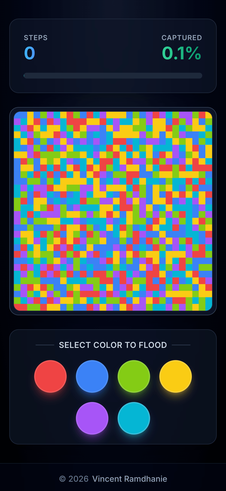

# 🌊 Flood Game

[](https://github.com/vramdhanie/flood/actions/workflows/deploy.yml)
[](https://flood.vincentramdhanie.com)
[](https://reactjs.org/)
[](https://www.typescriptlang.org/)
[](https://tailwindcss.com/)
[](https://opensource.org/licenses/MIT)

A color-flooding puzzle built with React 18, TypeScript, Vite, and TailwindCSS. Flood the whole board with a single color before the move budget runs out.



## 🎮 How to Play

1. You own the top-left region. Pick a color (click, or keys **1–6**) to flood your territory with it
2. Every adjacent cell of that color joins you — your region shows at full brightness
3. Fill the entire board before **Moves left** hits zero
4. Four boards: **Easy** (10×10), **Medium** (14×14), **Hard** (21×21), and a **Daily** — the same seeded board for everyone, with the strict classic budget

## ✨ Features

- 🎯 **A real game**: move budgets and a lose state — 25-ish moves, not unlimited clicking
- 🗓️ **Daily board**: date-seeded, identical for every player, with its own best score
- 🏆 **Best scores** per difficulty, kept in localStorage
- 🎨 **Color-blind safe**: Okabe–Ito palette with a distinct glyph on every swatch
- ⌨️ **Keyboard play**: 1–6 select colors
- 📱 **Responsive**, dark, quiet UI that keeps the board as the hero

## 🚀 Live Demo

**[Play the game now!](https://flood.vincentramdhanie.com)**

## 🛠️ Technology Stack

- **Frontend**: React 18 with TypeScript
- **Styling**: TailwindCSS
- **Build Tool**: Create React App
- **Package Manager**: pnpm
- **Deployment**: GitHub Pages with GitHub Actions
- **Code Quality**: ESLint, TypeScript strict mode

## 🏃‍♂️ Quick Start

### Prerequisites

- Node.js 18+ 
- pnpm (recommended) or npm

### Installation

```bash
# Clone the repository
git clone https://github.com/vramdhanie/flood.git
cd flood

# Install dependencies
pnpm install

# Start development server
pnpm dev

# Build for production
pnpm build
```

The game will be available at `http://localhost:5173`

## 🎯 Game Rules

- **Boards**: 10×10 (Easy, 20 moves), 14×14 (Medium, 26), 21×21 (Hard, 40), Daily (14×14, 25)
- **Colors**: 6, from the Okabe–Ito color-blind-safe palette
- **Start**: the top-left contiguous patch is your territory
- **Move**: flooding with a color absorbs every adjacent cell of that color
- **Win**: own the whole board within the budget; **Lose**: run out of moves

## 🧠 Algorithm

The game uses an efficient **Breadth-First Search (BFS)** flood-fill algorithm:

1. **Color Change**: All owned cells change to the selected color
2. **BFS Expansion**: Starting from owned cells, expand to adjacent cells of the same color
3. **Territory Growth**: Newly captured cells become part of your territory
4. **Win Detection**: Check if all cells are owned after each move

## 🔧 Development

### Project Structure

```
index.html          # Vite entry
src/
├── main.tsx        # React bootstrap
├── App.tsx         # The whole UI (header, status, board, controls)
├── game.ts         # Pure game logic: boards, budgets, flood, daily seed, best scores
└── index.css       # Tailwind + base styles
```

### Design Notes

- Game logic is pure and immutable (`game.ts`) — no React imports, trivially testable
- Board cells are memoized; unowned cells render dimmed so your territory is visible
- The Daily board seeds a deterministic RNG from the date, so everyone plays the same puzzle

## 🚀 Deployment

The game is automatically deployed to GitHub Pages using GitHub Actions:

- **Trigger**: Every push to the `main` branch
- **Build**: Optimized production build with pnpm
- **Deploy**: Automatic deployment to GitHub Pages
- **URL**: https://flood.vincentramdhanie.com

## 📝 License

This project is licensed under the MIT License - see the [LICENSE](LICENSE) file for details.

## 👨‍💻 Author

**Vincent Ramdhanie**
- Website: [vincentramdhanie.com](https://vincentramdhanie.com)
- GitHub: [@vramdhanie](https://github.com/vramdhanie)

## 🤝 Contributing

Contributions, issues, and feature requests are welcome! Feel free to check the [issues page](https://github.com/vramdhanie/flood/issues).

1. Fork the project
2. Create your feature branch (`git checkout -b feature/amazing-feature`)
3. Commit your changes (`git commit -m 'Add some amazing feature'`)
4. Push to the branch (`git push origin feature/amazing-feature`)
5. Open a Pull Request

## ⭐ Show Your Support

Give a ⭐️ if this project helped you or if you enjoyed playing the game!

---

*Built with ❤️ using React, TypeScript, and TailwindCSS*
