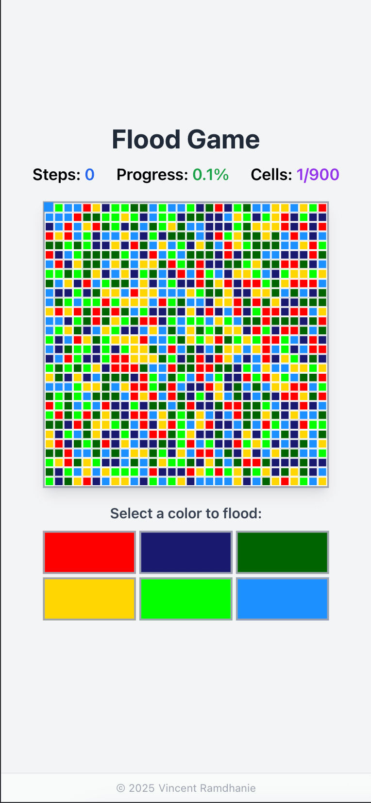

# 🌊 Flood Game

[](https://github.com/vramdhanie/flood/actions/workflows/deploy.yml)
[](https://vramdhanie.github.io/flood)
[](https://reactjs.org/)
[](https://www.typescriptlang.org/)
[](https://tailwindcss.com/)
[](https://opensource.org/licenses/MIT)

A modern, responsive flood game built with React 18, TypeScript, and TailwindCSS. The objective is to flood the entire grid with a single color in the smallest number of steps possible.



## 🎮 How to Play

1. **Start**: The grid begins with random colors, and you control the top-left cell
2. **Select Color**: Click any color button to flood your territory with that color
3. **Expand**: All adjacent cells of the selected color join your territory
4. **Strategy**: Choose colors that will capture the most adjacent cells
5. **Win**: Flood the entire 30×30 grid in the fewest steps possible!

## ✨ Features

- 🎯 **Strategic Gameplay**: Plan your moves to minimize steps
- 📊 **Real-time Stats**: Track steps, progress percentage, and cells owned
- 🏆 **Win Detection**: Automatic celebration when you flood the entire grid
- 🔄 **Instant Restart**: Play again without page refresh
- 📱 **Responsive Design**: Works perfectly on desktop and mobile
- 🎨 **Modern UI**: Clean, intuitive interface with smooth animations
- ⚡ **Performance Optimized**: Efficient flood-fill algorithm

## 🚀 Live Demo

**[Play the game now!](https://flood.vincentramdhanie.com)**

## 🛠️ Technology Stack

- **Frontend**: React 18 with TypeScript
- **Styling**: TailwindCSS
- **Build Tool**: Create React App
- **Package Manager**: pnpm
- **Deployment**: GitHub Pages with GitHub Actions
- **Code Quality**: ESLint, TypeScript strict mode

## 🏃‍♂️ Quick Start

### Prerequisites

- Node.js 18+ 
- pnpm (recommended) or npm

### Installation

```bash
# Clone the repository
git clone https://github.com/vramdhanie/flood.git
cd flood

# Install dependencies
pnpm install

# Start development server
pnpm start

# Build for production
pnpm build
```

The game will be available at `http://localhost:3000`

## 🎯 Game Rules

- **Grid Size**: 30×30 cells (900 total)
- **Colors**: 6 different colors to choose from
- **Starting Position**: Top-left cell is your initial territory
- **Flood Mechanism**: Selecting a color floods all connected cells of that color
- **Victory Condition**: Own all 900 cells
- **Scoring**: Minimize the number of steps to achieve the best score

## 🧠 Algorithm

The game uses an efficient **Breadth-First Search (BFS)** flood-fill algorithm:

1. **Color Change**: All owned cells change to the selected color
2. **BFS Expansion**: Starting from owned cells, expand to adjacent cells of the same color
3. **Territory Growth**: Newly captured cells become part of your territory
4. **Win Detection**: Check if all cells are owned after each move

## 🔧 Development

### Project Structure

```
src/
├── components/
│   ├── board/          # Game board component
│   ├── cell/           # Individual cell component
│   └── controls/       # Color selection controls
├── hooks/
│   ├── game.ts         # Main game logic and state
│   └── colours.ts      # Color management
└── types/
    └── images.d.ts     # TypeScript declarations
```

### Key Components

- **Game Hook**: Manages game state, flood-fill logic, and win detection
- **Board Component**: Renders the game grid and UI elements
- **Cell Component**: Individual grid cells with conditional styling
- **Controls Component**: Color selection buttons

## 🚀 Deployment

The game is automatically deployed to GitHub Pages using GitHub Actions:

- **Trigger**: Every push to the `main` branch
- **Build**: Optimized production build with pnpm
- **Deploy**: Automatic deployment to GitHub Pages
- **URL**: https://vramdhanie.github.io/flood

## 📝 License

This project is licensed under the MIT License - see the [LICENSE](LICENSE) file for details.

## 👨‍💻 Author

**Vincent Ramdhanie**
- Website: [vincentramdhanie.com](https://vincentramdhanie.com)
- GitHub: [@vramdhanie](https://github.com/vramdhanie)

## 🤝 Contributing

Contributions, issues, and feature requests are welcome! Feel free to check the [issues page](https://github.com/vramdhanie/flood/issues).

1. Fork the project
2. Create your feature branch (`git checkout -b feature/amazing-feature`)
3. Commit your changes (`git commit -m 'Add some amazing feature'`)
4. Push to the branch (`git push origin feature/amazing-feature`)
5. Open a Pull Request

## ⭐ Show Your Support

Give a ⭐️ if this project helped you or if you enjoyed playing the game!

---

*Built with ❤️ using React, TypeScript, and TailwindCSS*
